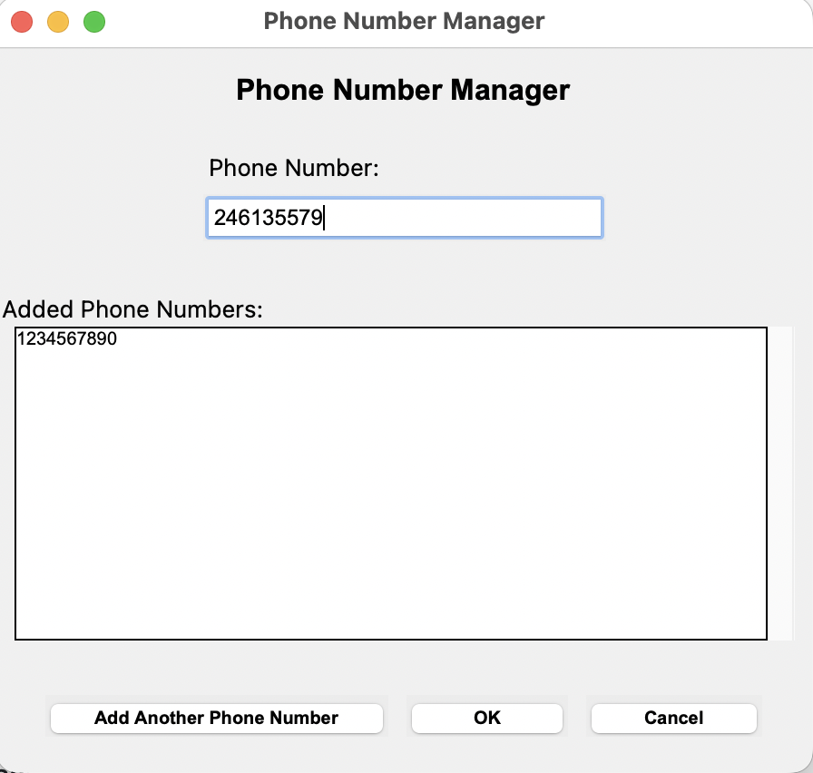
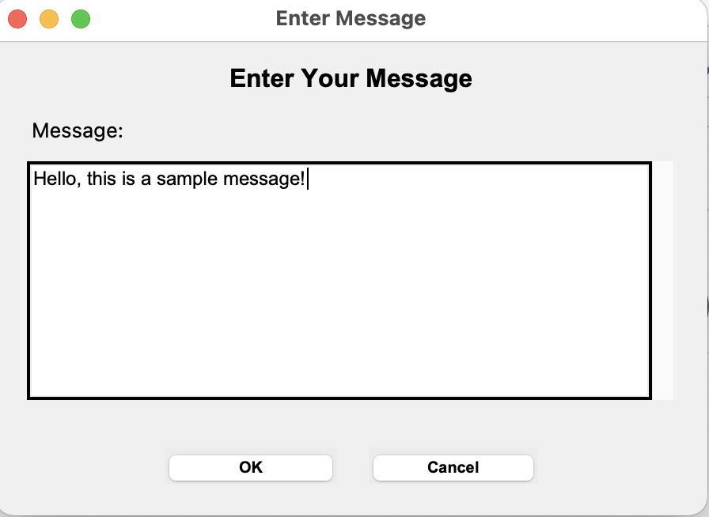
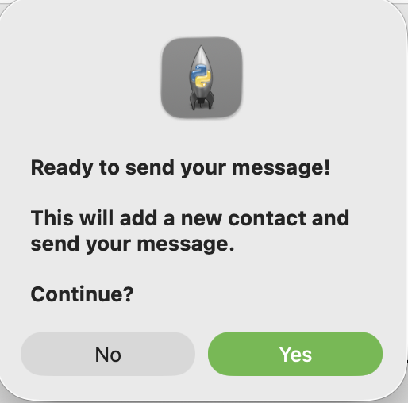
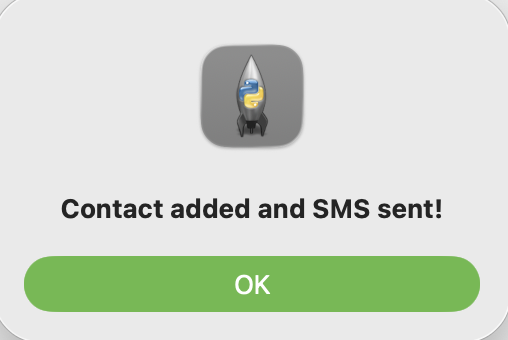
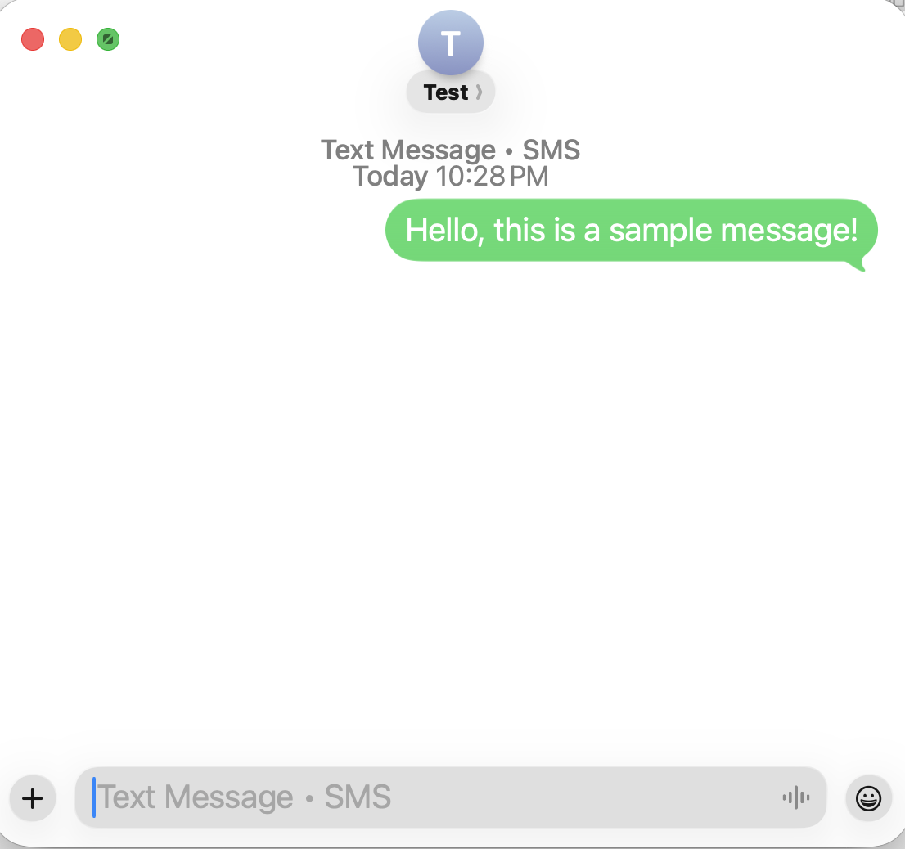

# Random Phone Number Selector (Mystery Messenger)

[](#)
[](#)
[](#)
[](#)

<p align="center"></p>

Small Tkinter utility that collects a list of phone numbers, lets you draft a single message, and then (after confirmation) sends the message to one randomly selected number. The app also adds the number chosen to Contacts so Messages can deliver the iMessage/SMS.

## Requirements

- macOS with Contacts and Messages apps configured for SMS relay
- Python 3.9+ (ships with Tkinter on macOS)

## Setup

1. Clone or download this directory.
2. (Optional) Activate a virtual environment if you want to isolate dependencies.
3. No additional packages are needed; the standard library covers everything.

## Usage

```bash
python3 phone_numbers.py
```

1. Enter phone numbers one at a time and click **Add Another Phone Number** (or press Enter) to build the list. Press **OK** to move to the message window once you have at least one number.
<p align="center"></p>

2. Draft your message and press **OK**.
<p align="center"></p>

3. You will be prompted to confirm.
<p align="center"></p>

4. When confirmed, the app randomly picks one saved number, adds a "Test" contact to Contacts, and sends the SMS through Messages.
<p align="center">
</p>


### macOS Permissions

The application requires the following macOS permissions:
- Access to **Contacts** app
- Access to **Messages** app
- SMS must be set up and configured in Messages

## Notes

- The script hides which number was chosen to keep the selection random.
- AppleScript commands run synchronously via `osascript`; failures will show up in the GUI and stdout.
- Cleanup removes both windows after completion or cancellation.

## Limitations

- **macOS Only**: Requires macOS operating system for Contacts and Messages integration
- **SMS Setup Required**: Messages app must be configured for SMS
- **Fixed Contact Name**: All contacts are created with the name "Test"
- **No Edit/Delete**: Cannot remove phone numbers once added (must restart app)

## Troubleshooting

### "Failed to add contact" error
- Ensure the Contacts app is accessible
- Check System Preferences > Security & Privacy > Privacy > Contacts
- Grant Terminal (or your Python interpreter) access to Contacts

### "Failed to send SMS" error
- Ensure the Messages app is open and configured for SMS
- Check that your Mac is connected to your iPhone for SMS relay
- Verify System Preferences > Security & Privacy > Privacy > Automation permissions

### Application doesn't start
- Verify Python 3 is installed: `python3 --version`
- Ensure tkinter is available: `python3 -m tkinter`

## License

Distributed under the MIT License. See [LICENSE](LICENSE) for more information.

## Contact

Denny - denny@aimh.co

Project Link: https://github.com/aimhco/random-phone-number-selector/

## Acknowledgements

This template was adapted from:
[https://github.com/othneildrew/Best-README-Template](https://github.com/othneildrew/Best-README-Template).

An extensive list of Shields.io badges: [https://github.com/inttter/md-badges](https://github.com/inttter/md-badges) 

Templates for open source and other licenses: 
[https://github.com/licenses/license-templates](https://github.com/licenses/license-templates) 
